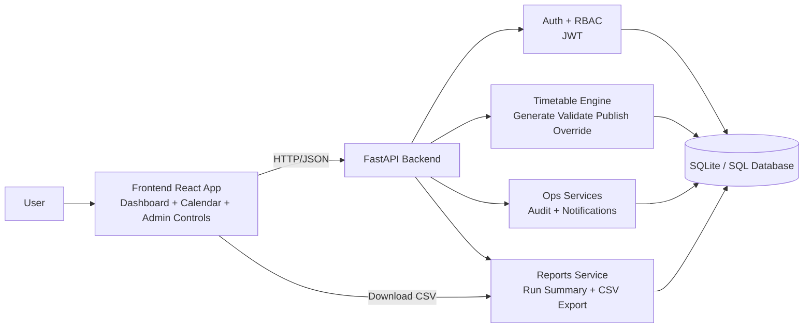
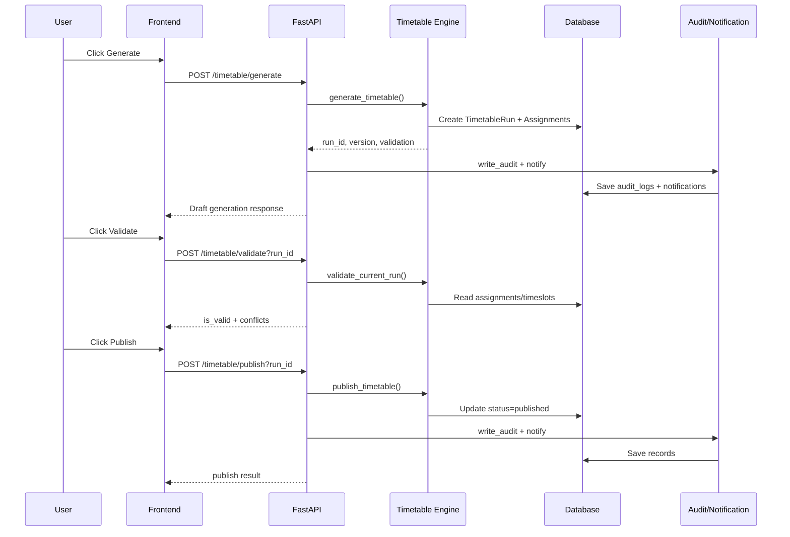

# Minerva Constraint Satisfaction Timetable Generator

Complete Phase 1 to Phase 5 timetable automation platform aligned to the PRD, including role-based UI, manual+auto scheduling, section-aware conflict checks, and Minerva chatbot-assisted data entry.

## Project Overview

Minerva helps institutions move from spreadsheet-based scheduling to a guided, role-aware system:
- Admin/Department Head manage master data and release runs.
- Faculty operate run workflows and manual adjustments.
- Students consume published schedules with clean read-only controls.
- Minerva chatbot supports preview+apply workflows for raw command-based data updates.
- Faculty/Admin can publish public academic resources from frontend.
- Students can read academic curriculum/notes/announcements from the Resources page.

## Repository Structure

- `backend` - FastAPI + SQLAlchemy APIs
- `frontend` - React role-aware multi-page web app
- `docs` - project documentation and implementation records

## Quick Start

### Backend

```bash
cd backend
python -m venv .venv
# activate venv (Windows)
. .venv/Scripts/Activate.ps1
pip install -r requirements.txt
uvicorn app.main:app --reload
```

### Frontend

```bash
cd frontend
npm install
npm start
```

## Core Phase 1 Endpoints

- `POST /register`
- `POST /login`
- `CRUD /departments`
- `CRUD /faculty`
- `CRUD /courses`
- `CRUD /rooms`
- `CRUD /timeslots`
- `CRUD /semesters`
- `POST /timetable/generate`
- `GET /timetable/`

## Phase 2 Endpoints

- `POST /timetable/validate`
- `POST /timetable/publish`
- `GET /timetable/runs`

## Phase 2 Highlights

- Constraint-aware draft generation with hard conflict prevention rules
- Validation endpoint for run-level conflict checks before publish
- Timetable run lifecycle with `draft/published` status, `version`, and `semester_id`

## Phase 3 Highlights

- Calendar-style timetable view in frontend
- Manual override endpoint for moving assignments between timeslots
- Conflict-highlighted cells driven by validation output
- Run-specific timetable loading for draft review and edit workflows

## Phase 4 Highlights

- Audit log API for schedule and lifecycle actions
- Notifications API (broadcast + per-user read)
- Report APIs:
  - `GET /reports/run-summary`
  - `GET /reports/run-export.csv`
- Timetable actions now emit audit + notification records

## Phase 5 Highlights

- Env-based security/config management:
  - JWT secret and expiry from environment
  - CORS origins from environment
- Added token expiration support
- Added health endpoint: `GET /health`
- Added `.env.example` for reproducible setup
- Added full run guide: `docs/RUN_FROM_SCRATCH.md`
- Added role-locked frontend navigation and single-login redirect by role
- Added dedicated `Section` model and API (`/sections/*`) for explicit section scheduling
- Added section-overlap validation in timetable engine (`section_overlap` conflict type)
- Added Minerva chatbot preview/apply flow (dry run before commit)
- Added Home dashboard cards for runs, publication status, notifications, and master-data counts
- Added backend seed script: `backend/scripts/seed_demo.py`
- Added unit tests for timetable section overlap: `backend/tests/test_timetable_validation.py`
- Added Resource Hub:
  - Backend model + APIs for public/confidential resources
  - Frontend Resources page for student reading
  - Faculty/Admin publish box for public academic content
- Added role-based signup/signin UX in frontend with persisted username/role/token

## Resource Hub Endpoints

- `POST /resources/public` (faculty/admin/department_head)
- `GET /resources/` (student/faculty/admin/department_head)
- `POST /resources/confidential` (admin-only, backend/manual workflow)
- `GET /resources/internal` (admin/department_head)

## Current Verification Status

Latest project health checks completed successfully:
- Backend compile: `python -m compileall backend/app backend/scripts`
- Backend tests: `python -m pytest backend/tests` (all passing)
- Frontend build: `npm run build`

Latest frontend reliability fix:
- Generate workflow now surfaces backend error messages clearly instead of showing undefined run/version when prerequisites are missing.

## Architecture Diagram





## Documentation

- `docs/PROJECT_FROM_SCRATCH.md`
- `docs/PHASE1_CHANGELOG.md`
- `docs/RUN_FROM_SCRATCH.md`
- `docs/OVERVIEW.md`